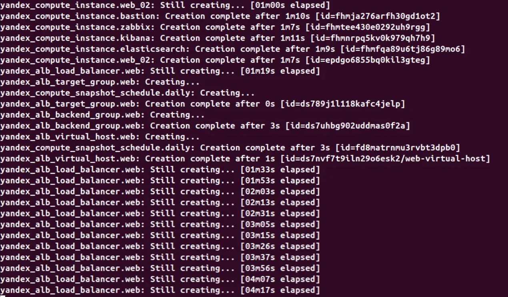
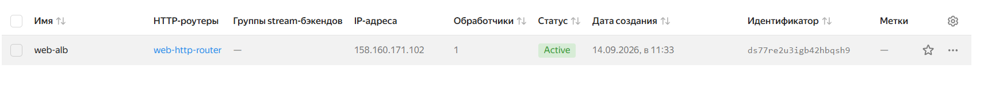
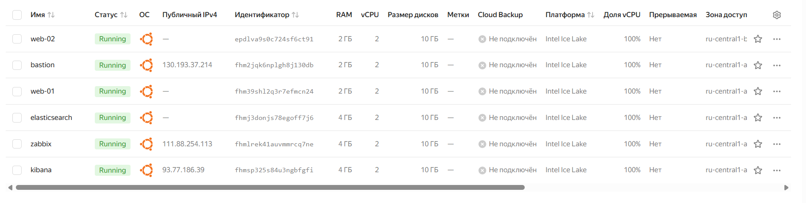
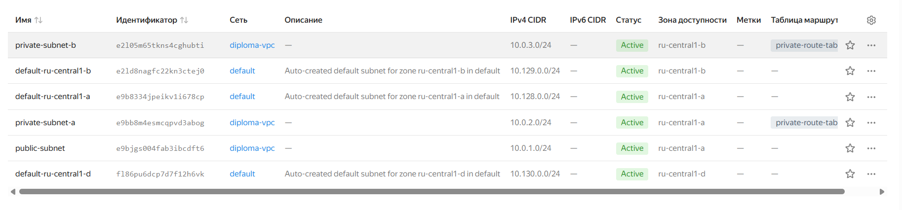
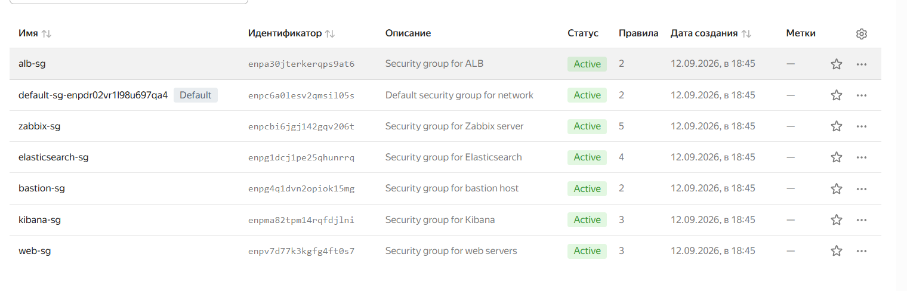
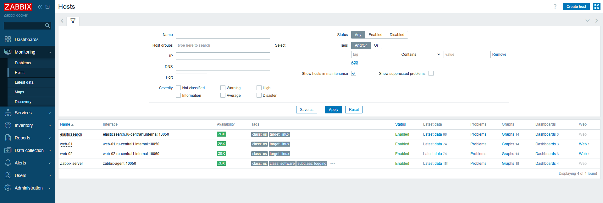
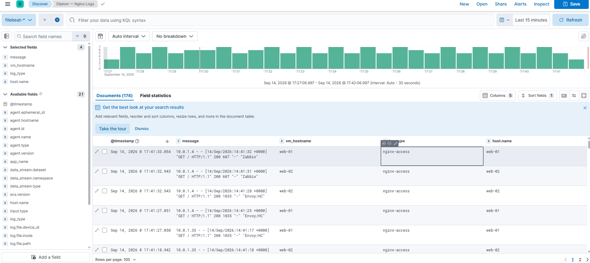
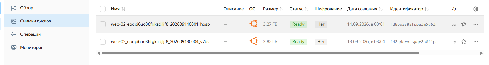

\# Дипломный проект: Автоматизация развёртывания веб-инфраструктуры в Yandex Cloud

Дипломная работа по развёртыванию отказоустойчивой веб-инфраструктуры

с использованием Infrastructure as Code (Terraform + Ansible).

\## 📋 Содержание

\- \[Технологии](#технологии)

\- \[Структура репозитория](#структура-репозитория)

\- \[Быстрый старт](#быстрый-старт)

\- \[Скриншоты](#скриншоты)

\*\*Компоненты:\*\*

\- \*\*VPC\*\* `diploma-vpc` — 3 подсети (public + 2 private) в зонах `ru-central1-a/b`

\- \*\*Bastion host\*\* — единственная точка входа для SSH

\- \*\*Application Load Balancer\*\* — балансировка L7 на 2 веб-сервера

\- \*\*2 веб-сервера\*\* (Nginx) — в приватных подсетях, в разных зонах доступности

\- \*\*Zabbix\*\* — мониторинг (в Docker), агенты на всех хостах

\- \*\*Elasticsearch + Kibana\*\* — централизованное логирование (в Docker)

\- \*\*Filebeat\*\* — сбор логов Nginx с веб-серверов

\- \*\*NAT-шлюз\*\* — исходящий интернет для приватных подсетей

\- \*\*Снапшоты\*\* — ежедневное резервное копирование (retention 7 дней)

\## 🛠️ Технологии

| Технология | Назначение |

|---|---|

| \*\*Terraform\*\* | Описание и создание инфраструктуры (IaC) |

| \*\*Ansible\*\* | Конфигурация серверов, установка сервисов |

| \*\*Yandex Cloud\*\* | Облачная платформа (Compute, VPC, ALB) |

| \*\*Nginx\*\* | Веб-сервер |

| \*\*Zabbix\*\* | Мониторинг (Docker) |

| \*\*Elasticsearch + Kibana + Filebeat\*\* | Логирование (ELK Stack, Docker) |

| \*\*Docker Compose\*\* | Оркестрация сервисов Zabbix и ELK |

\## 📂 Структура репозитория

\\`\\`\\`

.

├── terraform/          # Инфраструктура как код

├── ansible/            # Управление конфигурацией

└── docs/               # Документация и скриншоты

\\`\\`\\`

\### Шаг 1. Настройка сервисного аккаунта

\\`\\`\\`bash

\# Создать сервисный аккаунт

yc iam service-account create --name terraform-sa

\# Назначить роль editor

yc resource-manager folder add-access-binding \\\\

&#x20; --id <FOLDER\_ID> \\\\

&#x20; --role editor \\\\

&#x20; --service-account-name terraform-sa

\# Создать авторизованный ключ

yc iam key create \\\\

&#x20; --service-account-name terraform-sa \\\\

&#x20; --output key.json

\\`\\`\\`

\### Шаг 2. Развёртывание инфраструктуры

\\`\\`\\`bash

cd terraform

\# Скопировать пример переменных

cp terraform.tfvars.example terraform.tfvars

\# Отредактировать terraform.tfvars (cloud\_id, folder\_id)

\# Инициализация

terraform init

\# План

terraform plan

\# Применение (создание 25 ресурсов, \~15 минут)

terraform apply

\# Сохранить outputs

terraform output

\\`\\`\\`

\### Шаг 3. Настройка серверов через Ansible

\\`\\`\\`bash

\# Скопировать SSH-ключ на bastion

scp \~/.ssh/id\_ed25519 ubuntu@<BASTION\_IP>:\~/.ssh/id\_ed25519

\# Войти на bastion

ssh ubuntu@<BASTION\_IP>

\# Внутри bastion:

cd \~/ansible

ansible all -m ping              # проверка связи

\# Запустить плейбуки

ansible-playbook -i inventory.ini playbooks/web/web.yml

ansible-playbook -i inventory.ini playbooks/zabbix/zabbix-docker.yml

ansible-playbook -i inventory.ini playbooks/zabbix-agent/zabbix-agent.yml

ansible-playbook -i inventory.ini playbooks/elasticsearch/elasticsearch.yml

ansible-playbook -i inventory.ini playbooks/kibana/kibana.yml

ansible-playbook -i inventory.ini playbooks/filebeat/filebeat.yml

\\`\\`\\`

## 📸 Скриншоты

### 1. Развёртывание инфраструктуры (Terraform)

**Создание 25 ресурсов в Yandex Cloud через `terraform apply`:**

| Ресурсы VPC | Ресурсы Compute | Ресурсы ALB |
|---|---|---|
|  |  |  |
|  |  | |

**Результат применения — публичные IP и FQDN всех ресурсов:**

---

### 2. Веб-серверы и балансировщик

**Сайт открывается через Application Load Balancer, трафик распределяется между `web-01` и `web-02`:**

| Web-01 | Web-02 |
|---|---|
|  |  |

**Распределение трафика 50/50 подтверждается дашбордом Kibana:**

---

### 3. Мониторинг (Zabbix)

**Все хосты подключены и отправляют метрики:**

**Дашборд с USE-метриками (Utilization, Saturation, Errors):**

**Web Scenario `Check site via ALB` — мониторинг HTTP-доступности сайта:**

| Статус сценария | Время отклика |
|---|---|
|  |  |

---

### 4. Логирование (ELK Stack)

**Логи Nginx из Elasticsearch в Kibana Discover:**

**Дашборд с распределением логов по веб-серверам:**

---

### 5. Резервное копирование

**Ежедневные снапшоты дисков всех ВМ (retention 7 дней):**

